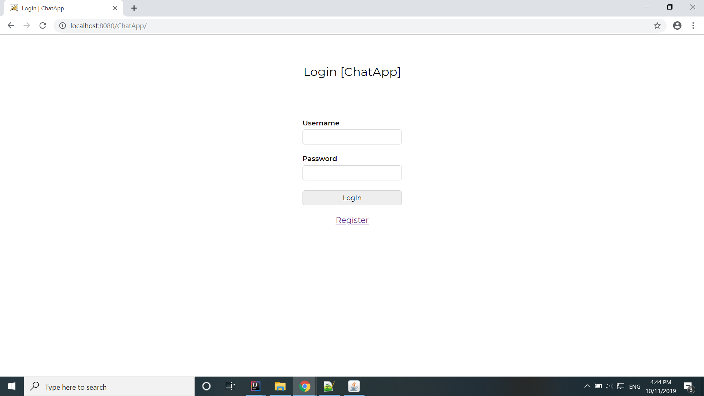
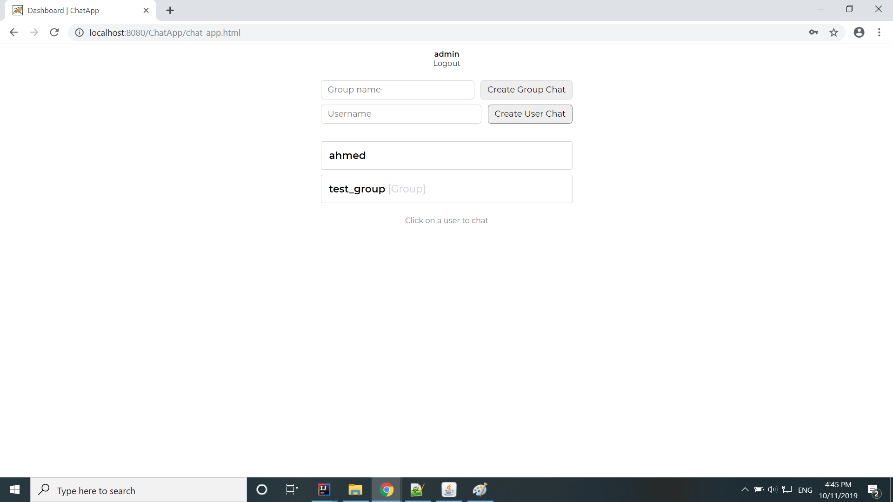
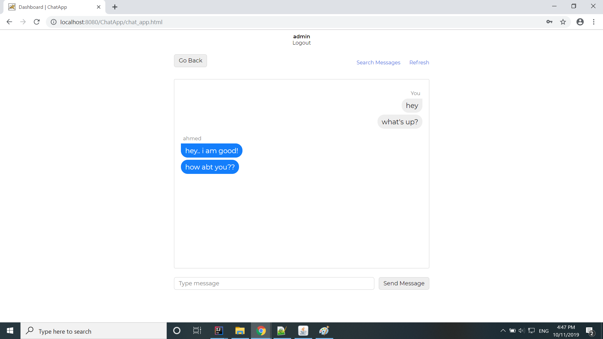
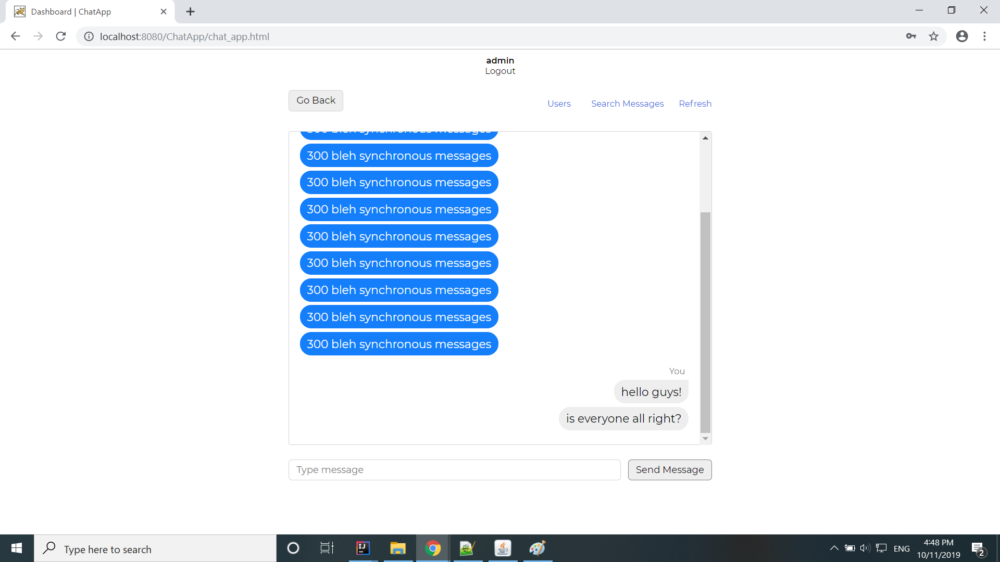
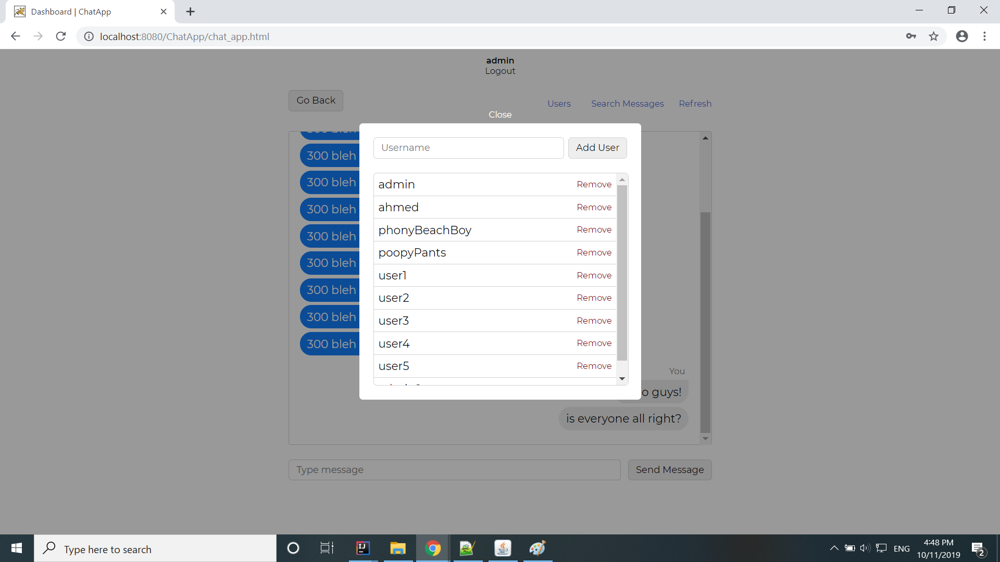
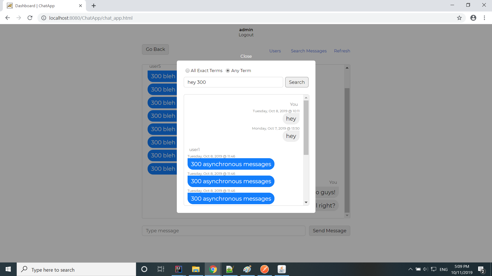
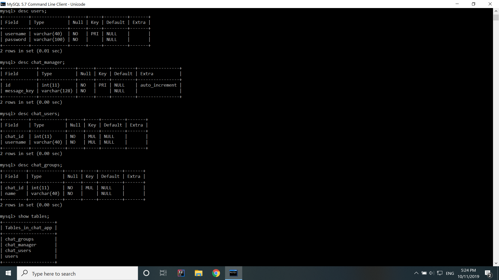
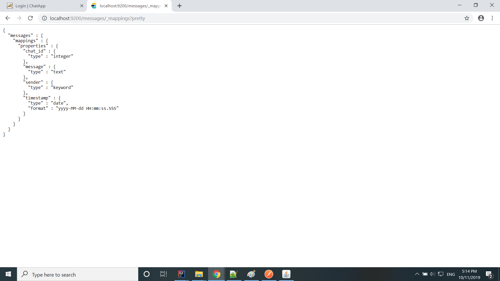

# ChatApp

A simple chat application build using Java Servlets, MySQL and ElasticSearch

## Setting up
  - Clone repo in your Tomcat's webapps folder
  - Run application:
    `ant`

## Screenshots

### Login Page

### Dashboard

### Chat

### Group Chat

### Adding User to group

### Message Search

## Database Formats

### MySQL Database Tables

### Elasticsearch Node Mapping

